# Presentación

## 

:::::::::::::: {.columns}
::: {.column width="35%"}
[Pablo Beltrán Pellicer](http://personal.unizar.es/pbeltran/)
 <small>pabelpe@gmail.com</small>

:::
::: {.column width="35%"}
[Carlos Rodríguez Jaso](https://crdguez.github.io/about/)
 <small>carlos.rodriguez.jaso@gmail.com</small>

:::
::::::::::::::

## El proyecto

:::::::::::::: {.columns}
::: {.column width="60%"}

* Origen: **Exploración** de las posibilidades matemáticas en la **impresión y modelado 3D**.  

*  **BlocksCAD** es un programa para modelar objetos en 3D basado en **bloques**
* Desarrolla **el pensamiento computacional** y la **capacidad espacial**, 
* Permite trabajar **contenidos matemáticos**, sobre todo de geometría, aunque no exclusivamente

:::
::: {.column width="40%"}
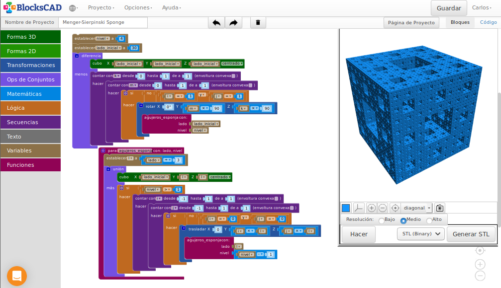

[https://www.blockscad3d.com/editor/](https://www.blockscad3d.com/editor/)

[Esponja de Menger con BlocksCAD](https://www.blockscad3d.com/community/projects/264994)

:::
::::::::::::::

::: notes

:::

## Documentación

Toda la **documentación** del proyecto se encuentra liberada en [Github](https://github.com/mat3d):

:::::::::::::: {.columns}

::: {.column width="45%"}

*  [acerca de](https://github.com/mat3d/acerca_de): **Información del proyecto**, presentaciones, enlaces a recursos, ...
*  [actividades3d](https://github.com/mat3d/actividades3d): Wiki con **actividades** de modelado
*  [mat3d.github.io](https://github.com/mat3d/mat3d.github.io): El **código fuente** de la [página web](http://mat3d.github.io)

:::

::: {.column width="40%"}

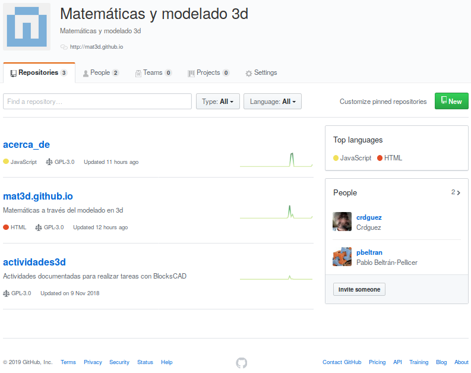
:::
::::::::::::::
Si quieres colaborar, puedes ponerte en contacto con alguien del proyecto

::: notes
* Si no estás familiarizado con Github, desde la web accederás mejor a los contenidos.
* Si alguien quiere colaborar, puede ponerse en contacto con alguien del proyecto. Nos encataría que más personas ampliaran el proyecto.
:::

# Conociendo BlocksCAD

## Acceso

:::::::::::::: {.columns}
::: {.column width="60%"}

* Usando la **web de BlocksCAD**: [https://www.blockscad3d.com ](https://www.blockscad3d.com/)
* Opciones:
	- Probar --> [Create Now](https://www.blockscad3d.com/editor)
	- Registrarte en su web --> [Register](https://www.blockscad3d.com/account/register/)

 

* **Alternativa: **Crear un servidor local. Instrucciones en el [repositorio Github con el código libre de BlocksCAD](https://github.com/EinsteinsWorkshop/BlocksCAD)
:::
::: {.column width="40%"}
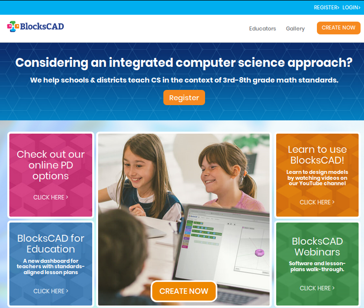
:::
::::::::::::::

## El entorno

:::::::::::::: {.columns}
::: {.column width="60%"}
- **Barra de menús**/herramientas:
	- Idioma 
	- Proyectos
	- Opciones
- Barra de **bloques**
- **Área de programa o proyecto**: ficheros .xml
- Área de **renderizado** o visualización de objetos

:::
::: {.column width="40%"}
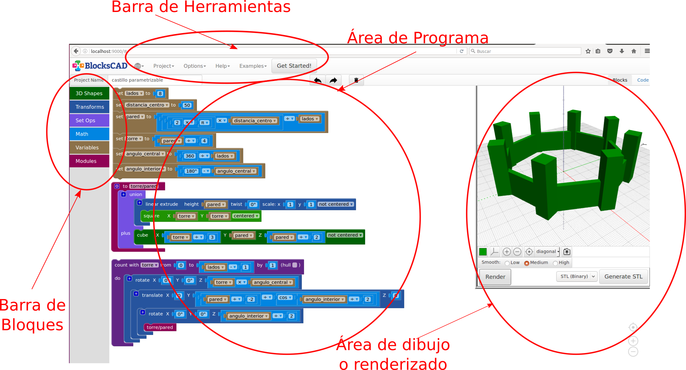

[https://www.blockscad3d.com/editor/](https://www.blockscad3d.com/editor/)
:::
::::::::::::::

Ya podemos empezar. Seguiremos este [tutorial](https://github.com/mat3d/actividades3d/wiki/Introducci%C3%B3n-a-BlocksCAD)

## Empezamos a modelar: Cubo "Hola Mundo"

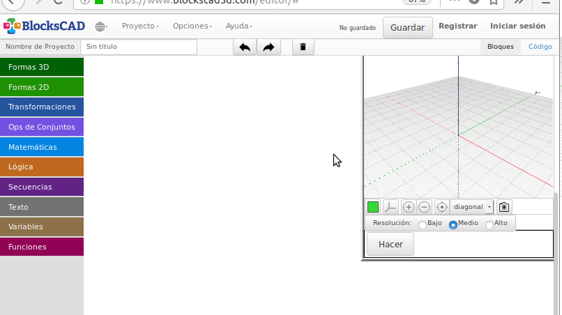

[https://www.blockscad3d.com/editor/](https://www.blockscad3d.com/editor/)

## Más formas 3D

:::::::::::::: {.columns}
::: {.column width="60%"}

* **Esferas**
* **Cilindros**:
	- Cilindros
	- **Conos** y troncos
	- **Prismas** y troncos
	- **Pirámides**

:::
::: {.column width="40%"}
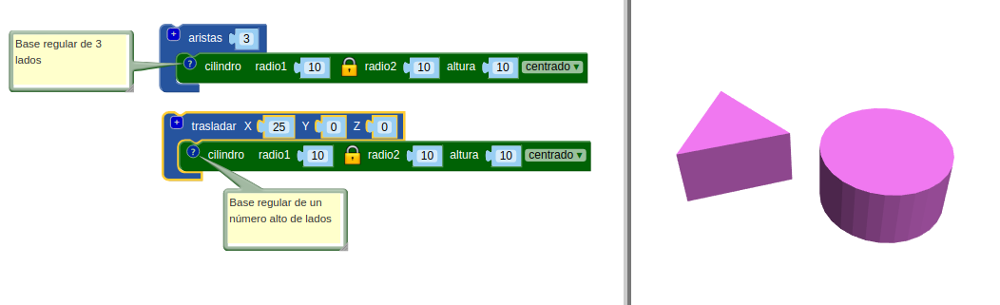

[https://www.blockscad3d.com/editor/](https://www.blockscad3d.com/editor/)
:::
::::::::::::::

## Esferas

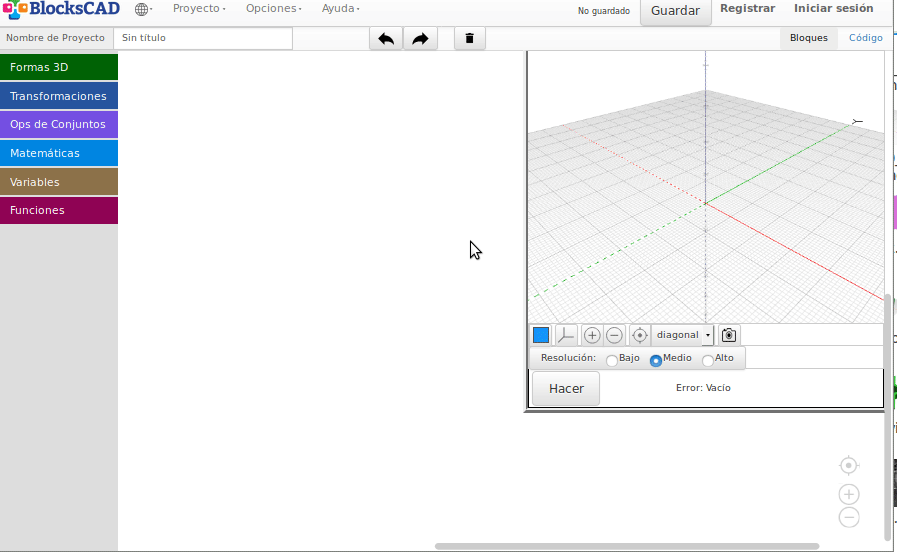

[https://www.blockscad3d.com/editor/](https://www.blockscad3d.com/editor/)

## Cilindros, conos y troncos

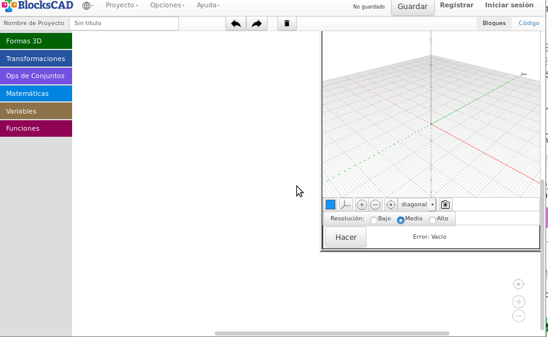

[https://www.blockscad3d.com/editor/](https://www.blockscad3d.com/editor/)

## Prismas, pirámides y troncos

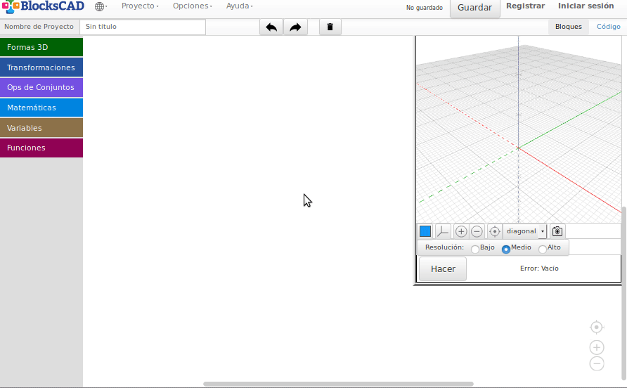

[https://www.blockscad3d.com/editor/](https://www.blockscad3d.com/editor/)

## Transformaciones en el espacio

:::::::::::::: {.columns}
::: {.column width="60%"}

* **Traslaciones**
* **Rotaciones**
* Escalas
* Simetrías
:::
::: {.column width="40%"}
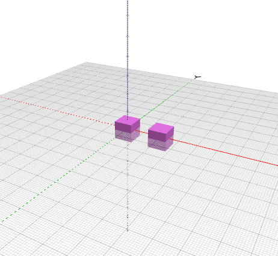

[https://www.blockscad3d.com/editor/](https://www.blockscad3d.com/editor/)
:::
::::::::::::::

## Traslaciones

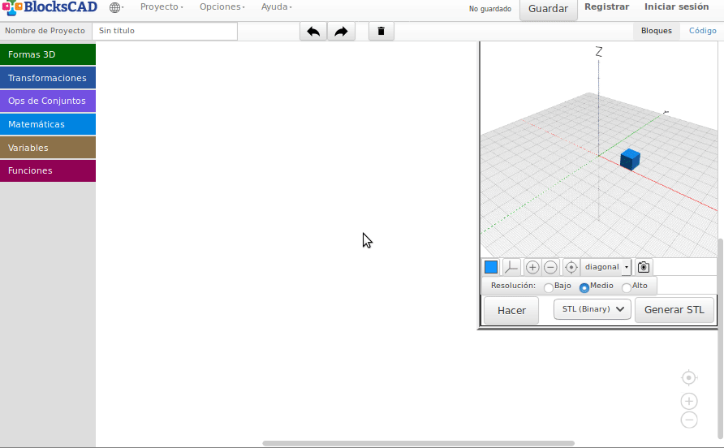

[https://www.blockscad3d.com/editor/](https://www.blockscad3d.com/editor/)

## Rotaciones

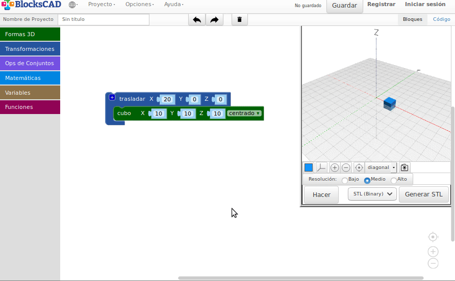

[https://www.blockscad3d.com/editor/](https://www.blockscad3d.com/editor/)

## Escalas

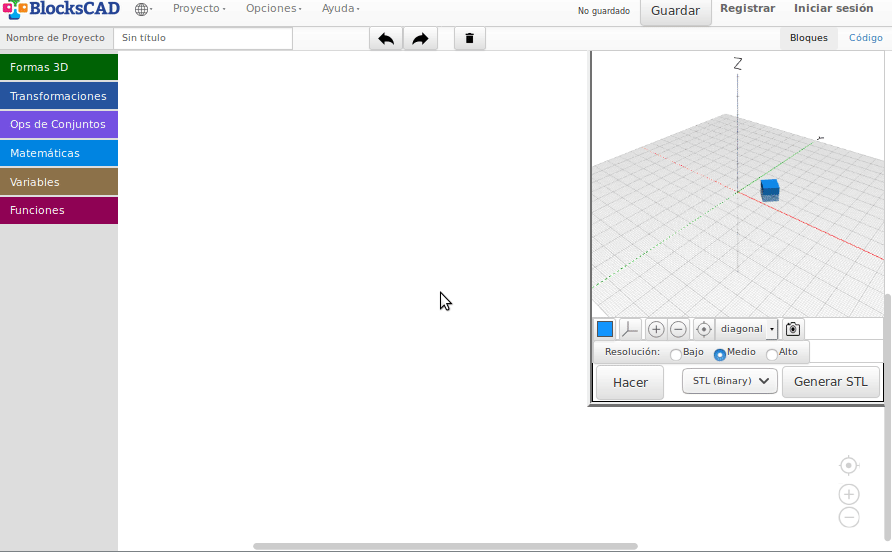

[https://www.blockscad3d.com/editor/](https://www.blockscad3d.com/editor/)

## Simetrías

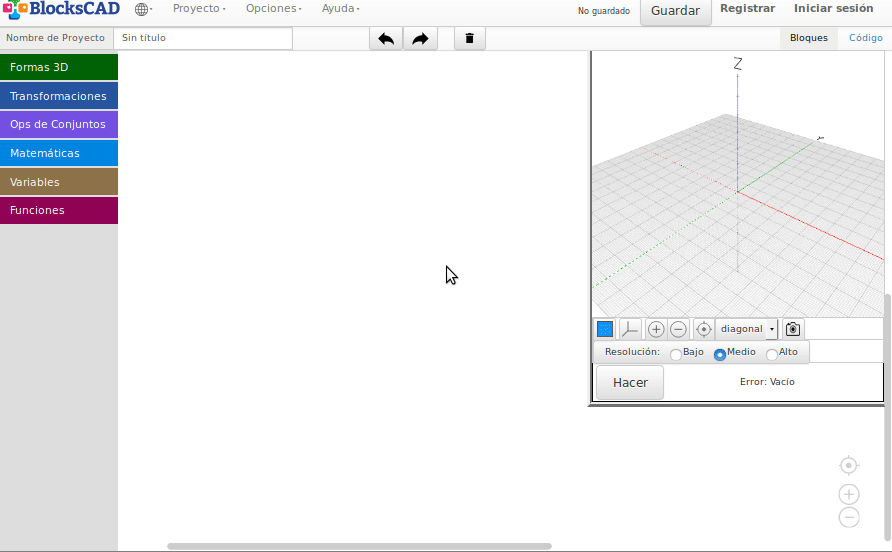

[https://www.blockscad3d.com/editor/](https://www.blockscad3d.com/editor/)

## Operaciones de conjuntos ($\cup$,$\cap$, $\setminus$)

:::::::::::::: {.columns}
::: {.column width="60%"}

* **Unión** (Pegar objetos)
* **Diferencia** ("Hacer agujeros")
* Intersección ("Zonas comunes")

:::
::: {.column width="40%"}
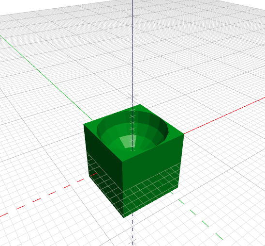

[https://www.blockscad3d.com/editor/](https://www.blockscad3d.com/editor/)
:::

::::::::::::::

## Unión

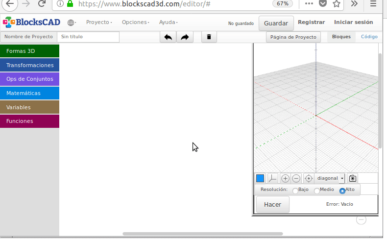

[https://www.blockscad3d.com/editor/](https://www.blockscad3d.com/editor/)

## Diferencia

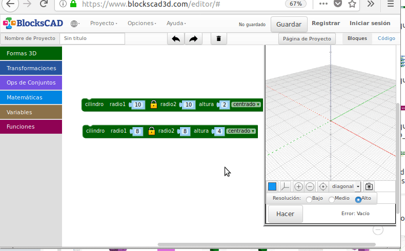

[https://www.blockscad3d.com/editor/](https://www.blockscad3d.com/editor/)

## Intersección

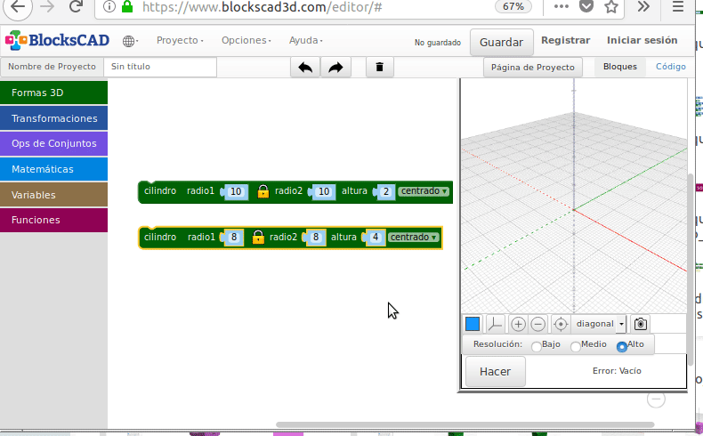

[https://www.blockscad3d.com/editor/](https://www.blockscad3d.com/editor/)

## ¡Ya sabes lo básico para manejarte con BlocksCAD!

# Actividad propuesta: Spinner

## 
:::::::::::::: {.columns}
::: {.column width="40%"}

Modela un **spinner de dos ramas** con tres agujeros para cilindros de **radio 11mm y 7 mm de altura**. Tienes que conseguir algo parecido a esto:
:::
::: {.column width="60%"}
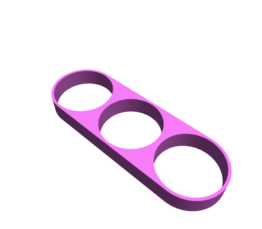

[https://www.blockscad3d.com/editor/](https://www.blockscad3d.com/editor/)
:::
::::::::::::::
## Posible solución

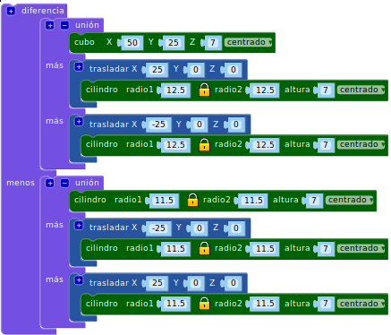

# BlocksCAD "avanzado"

## Variables

:::::::::::::: {.columns}
::: {.column width="20%"}

- Una **variable** es un contenedor de datos
- Los datos serán medidas
- Permiten parametrizar objetos

:::
::: {.column width="70%"}
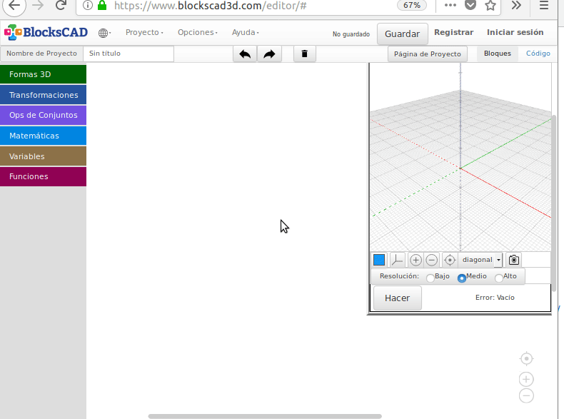
[https://www.blockscad3d.com/editor/](https://www.blockscad3d.com/editor/)
:::
::::::::::::::

## Operaciones matemáticas

* **Operaciones matemáticas** con las medidas y los valores de las variables

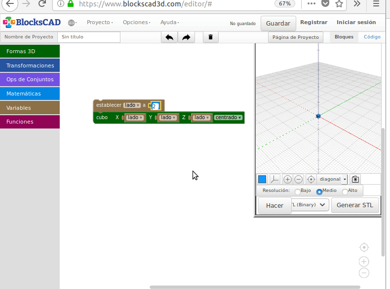
[https://www.blockscad3d.com/editor/](https://www.blockscad3d.com/editor/)

## Bucles o repeticiones

:::::::::::::: {.columns}
::: {.column width="20%"}

* **Repetición** de un conjunto de bloques 
* El **número de repeticiones** se controla con una variable a la que llamaremos contador

:::
::: {.column width="70%"}
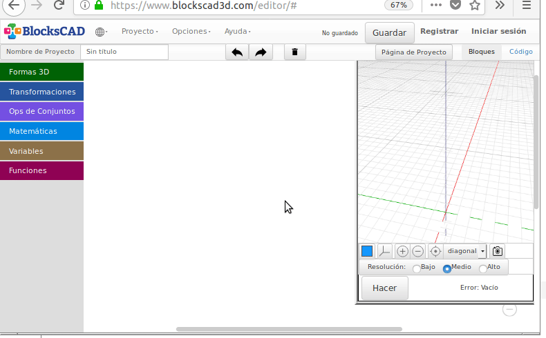

[https://www.blockscad3d.com/editor/](https://www.blockscad3d.com/editor/)
:::
::::::::::::::

## Funciones

:::::::::::::: {.columns}
::: {.column width="20%"}

* Permiten **encapsular un conjunto de bloques** en otro

* al ejecutar la función ejecutaremos internamente los bloques encapsulados

:::
::: {.column width="70%"}

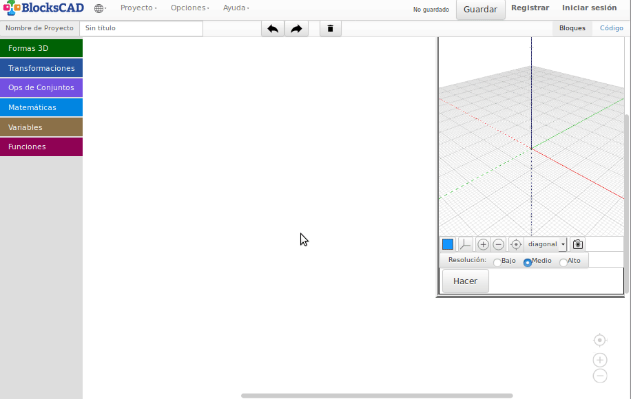

[https://www.blockscad3d.com/editor/](https://www.blockscad3d.com/editor/)
:::
::::::::::::::

# Actividad propuesta:

## Spinner paramétrico

:::::::::::::: {.columns}
::: {.column width="60%"}

Realiza un **spinner de dimensiones "variables"** donde se pueda elegir el **tamaño del agujero, el grosor del spinner y el número de ramas** 

- Crea una función que genere una rama

- Repite la función anterior haciendo el giro que corresponda para obtener el spinner deseado

- El resto de las medidas se dejan a criterio del diseñador, pero que queden proporcionales

  

:::
::: {.column width="40%"}
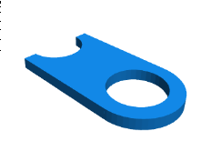

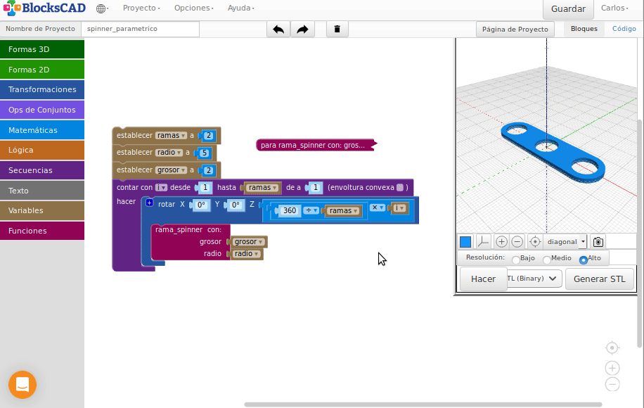

:::

[https://www.blockscad3d.com/editor/](https://www.blockscad3d.com/editor/)

[Una posible solución](https://www.blockscad3d.com/community/projects/447547)

::::::::::::::

# Inspírate: Desafío 1

## Estrella mudéjar

:::::::::::::: {.columns}
::: {.column width="50%"}

Modela el objeto de la derecha:

- La **estrella mudéjar** es un elemento decorativo ampliamente utilizado desde tiempos remotos por diferentes civilizaciones mediterráneas.
- En Aragón resulta un ornamento muy característico del mudéjar
- Aparece al superponer los centros de dos cuadrados idénticos pero uno girado 45º con respecto al otro

:::
::: {.column width="50%"}

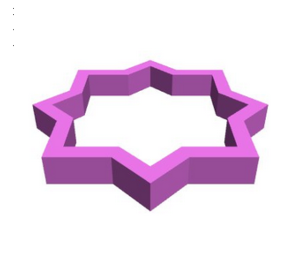

[https://www.blockscad3d.com/editor/](https://www.blockscad3d.com/editor/)

[una solución posible](https://www.blockscad3d.com/community/projects/266387)

:::
::::::::::::::

## Estrella mudéjar 2

:::::::::::::: {.columns}
::: {.column width="60%"}

Modela el objeto de la derecha con el número de lados como parámetro:

- La mitad de las puntas las tienen que  **generar un prisma cuadrado** con la diagonal superpuesta sobre la arista (el lado del cuadrado se pide que sea **1/3 de la arista**).

  Como una imagen vale más que mil palabras:

  

:::
::: {.column width="40%"}

[https://www.blockscad3d.com/editor/](https://www.blockscad3d.com/editor/)

[una solución posible](https://www.blockscad3d.com/community/projects/267149)

:::
::::::::::::::

# 

# Inspírate: Desafío 2

## Cono de Apolonio

:::::::::::::: {.columns}
::: {.column width="60%"}

Modela un cono como el que aparece a la derecha y practica con las secciones de un cono

- Al cortar con un plano diferentes puntos del cono obtenemos un serie  de curvas planas llamadas cónicas. Las diferentes curvas reciben los  siguientes nombres:
  - **círculo**: corte con un plano paralelo a la base del cono
  - **elipse**: corte oblícuo con respecto a la base  e  inclinación menor a la generatriz del cono (siendo el ángulo de  inclinación el  que forma el plano con el plano normal al eje de  simetría del cono)
  - **parábola**: corte de un plano paralelo a una generatriz del cono
  - **hipérbola**: corte oblícuo con respecto a la base  e inclinación mayor a la generatriz del cono

:::
::: {.column width="40%"}

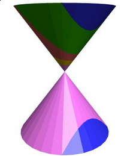

[https://www.blockscad3d.com/editor/](https://www.blockscad3d.com/editor/)

[una solución posible](https://www.blockscad3d.com/community/projects/354345)

:::
::::::::::::::

#  Finalizando ...

## Preguntas y Gracias por vuestra atención
