---

title: Programando la Geometría con BlocksCAD
author: Pablo Beltrán Pellicer, Carlos Rodríguez
header: This is fancy
footer: So is this
geometry: margin=1in
abstract: BlocksCAD workshop. Coding geometry. pandoc -s -o ttm1819.pdf --latex-engine=xelatex ttm1819.md
---

# Programando la geometría con BlocksCAD

Taller de BlocksCAD organizado para una de las sesiones del [Taller de Talento Matemático](ttm.unizar.es/) de la Universidad de Zaragoza. El objetivo del taller no es otro que iniciarse en las posibilidades de BlocksCAD desde un punto de vista matemático.

**Página Web:** [https://mat3d.github.io/](https://mat3d.github.io/)

**Documentación:** [https://github.com/mat3d](https://github.com/mat3d)  

**Autores:** Pablo Beltrán Pellicer, Carlos Rodríguez

# Índice

[TOC]

# Introducción a [BlocksCAD](https://www.blockscad3d.com/)

**BlocksCAD** es un programa para modelar objetos en 3D. En realidad es una interfaz web de su hermana mayor [OpenSCAD](http://www.openscad.org), pero que la hace especialmente sencilla de usar porque está basada en bloques tipo [Scratch](http://scratch.mit.edu). El uso de bloques hace que sea una estupenda herramienta para desarrollar el pensamiento computacional, la capacidad espacial y el modelado en 3D. Todo ello sin necesidad de tener conocimientos de programación.

La forma más sencilla de trabajar es de manera online a través de su web: [https://www.blockscad3d.com/](https://www.blockscad3d.com/)

## El entorno

El entorno de trabajo de BlocksCAD lo podemos dividir en tres partes:

1. **Área de Programa:** Conjunto de bloques que reprensentan las instrucciones a ejecutar para "renderizar" el modelo 3D. Se arrastran desde la *barra de bloques* y se van encajando unos con otros para determinar la lógica de ejecución-construccion.
2. **Barra de bloques:** Paleta que contiene los bloques que se pueden utilzar en el *área de programa*. Los bloques se arrastran de una zona a otra
3. **Área de dibujo o renderizado:** Al darle al botón *render*, el programa ejecuta y renderiza el modelo 3D a partir de los bloque que aparezcan en el *área de programa*. Fíjate que el espacio viene dado por las **dimensiones X, Y, Z**. El **plano XY** viene en forma de rejilla, cada **cuadrado es de 10x10 mm²** y cada marca fina representa 1mm reales.

Además, tenemos la típica **Barra de Herramientas y menús** para manejar los archivos, determinar las preferencias del entorno o acceder a la ayuda del programa.

## Aprendiendo lo básico

**Nota:** Se recomienda, sobre todo al principio, selecciónar en la **Barra de Herramientas** que solo aparezcan las funciones básicas: *Opciones - Colección simple de bloques*

### Formas 3D: 

Son los objetos primitivos que podemos utilizar, y que se pueden transformar con el resto de bloques de los otros grupos:

#### Cubos: Mi primer objeto en 3D

Cuando se aprende un lenguaje de programación como pueda ser este, normalmente, la primera actividad que se propone es una programa muy sencillo que permita al usuario familiarizarse con la herramienta. Antiguamente para los lenguajes de programación tradicionales, un programa típico era hacer que por pantalla apareciera el texto **Hola mundo**. En nuestro caso, lo más sencillo es construir un cubo, por lo que éste va a ser nuestro **Hola mundo** particular.

**Procedimiento:**

Dentro del bloque *Formas 3d*, arrastramos el bloque 
 y lo llevamos a la zona del programa.

Ya tenemos nuestro primer programa con BlocksCAD. Le estamos diciendo que modele un cubo, pero no lo vemos aún. Nos falta ejecutar la instrucción para que lo genere. En los programas de modelado a la ejecución de un programa que contiene un diseño se le llama **renderizado**. Para renderizar, hemos de ir al *área de dibujo o renderizado* y pulsar el botón **Hacer** que se encuentra en la esquina inferior izquierda. El resultado será algo parecido a esto:

Observa qué pasa cuando modificas los parámetros:

#### Esferas

Dentro del bloque *Formas 3D* podemos arrastrar el bloque 
.

Al renderizarlo obtendremos una esfera de *10mm* de radio:

#### Cilindros y mucho más

Dentro del bloque *Formas 3D*, tenemos el bloque  

Vamos a ver qué parámetros se pueden modificar:

- **radio1**, es el radio de la base inferior de la figura a modelar
- **candado**, por defecto aparece cerrado, y esto hace que el parámetro **radio2** herede el valor de **radio1**
- **radio2**, radio de la base superior de la figura. Cuando coincida con **radio1** tendremos un cilindro, y cuando no, tendremos un **tronco de cono** o un **cono** si ponemos que el radio es cero.
- **altura**, altura del cilindro.
- **centered/not centered**, centrado en el origen de coordenadas o no

Además, BlocksCAD interpreta la base del cilindro como un polígono regular de "muchos" lados. Podemos generar un prisma de base regular modificando ese "muchos" con el bloque   que aparece en *Transformaciones*. Mira este ejemplo que compara un cilindro con un prisma de base triangular:

**Más ejemplos:**

|                  Bloque                   |                   Renderizado                   |
| :---------------------------------------: | :---------------------------------------------: |
| 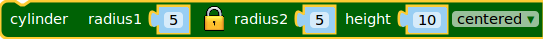 | 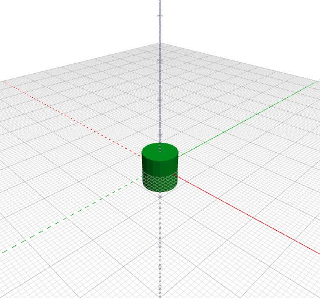 |
|      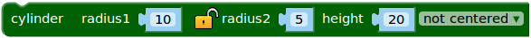       | 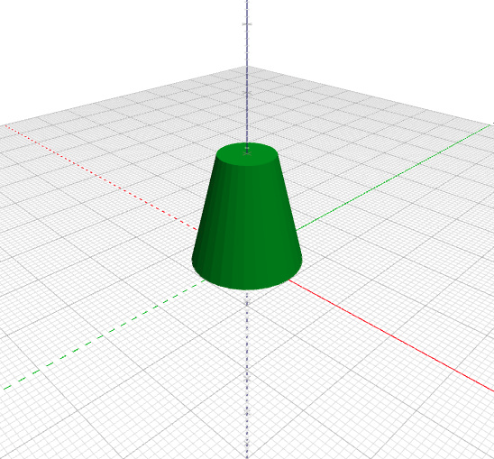 |
|      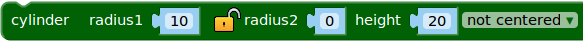       |   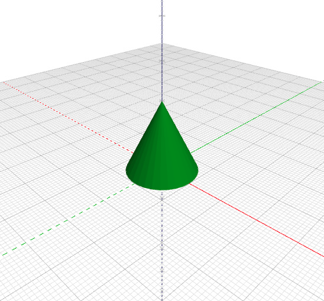   |

### Transformaciones

Nos permite desplazar, rotar y escalar los objetos.

#### Traslaciones 

Cuando *renderizamos* una de las primitivas anteriores, éstas aparecen colocadas en el centro de coordenadas. Mediante las traslaciones podemos desplazarlas a cualquier lugar del espacio usando *vectores de posición*. Para trasladar un objeto tendremos que seguir el siguiente procedimiento: Dentro del bloque *Formas 3D*, arrastramos el bloque 
 y lo llevamos a la zona del programa. Una vez ahí, colocamos dentro, arrastrando, los bloques correspondientes al objeto a trasladar.

En este caso, los parámetros **X**, **Y** y **Z**, son las coordenadas del vector de traslación.    

#### Rotaciones

Para rotar un objeto, arrastramos el bloque     y lo llevamos a la zona del programa. Una vez ahí, colocamos dentro, arrastrando, los bloques correspondientes al objeto a rotar. En este caso, los parámetros **X**, **Y** y **Z**, son los grados a rotar en los diferentes ejes. 

**Ejemplos:**

| Ejemplo                                                      | Bloque                         |            Renderizado            |
| :----------------------------------------------------------- | :----------------------------- | :-------------------------------: |
| Prisma de 10x20x30 centrado y trasladado 30 en la dirección X, 30 en la Y y 40 en la Z | 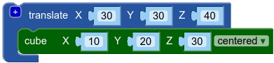 | 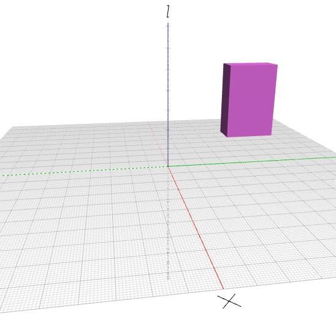 |
| Ejercicio anterior rotado 45º en el eje X                    | 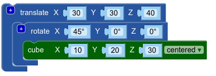 |  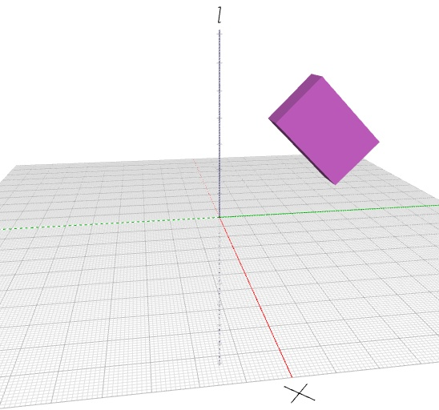  |

### Ops de Conjuntos: Operaciones lógicas 

#### Unión: Pegando objetos

Para unir dos o más objetos tenemos que seleccionar el bloque . En el bloque vemos que hay espacio para colocar dos sub-bloques, correspondientes a los objetos que queramos unir. Si queremos unir más de un objeto, pinchado en el símbolo +, podremos añadir espacio para nuevos sub-bloques.

#### Diferencia: Haciendo agujeros

Si con la unión lo que hacemos es "pegar" objetos, con la diferencia lo que hacemos es hacer "agujeros". La forma de trabajar con el bloque es similar a la unión pero, obviamente, con resultados diferentes.

**Ejemplos:**

|             Bloque             |           Renderizado           |
| :----------------------------: | :-----------------------------: |
| 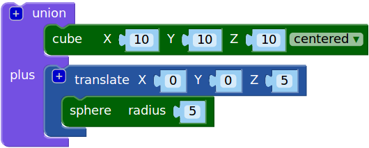 | 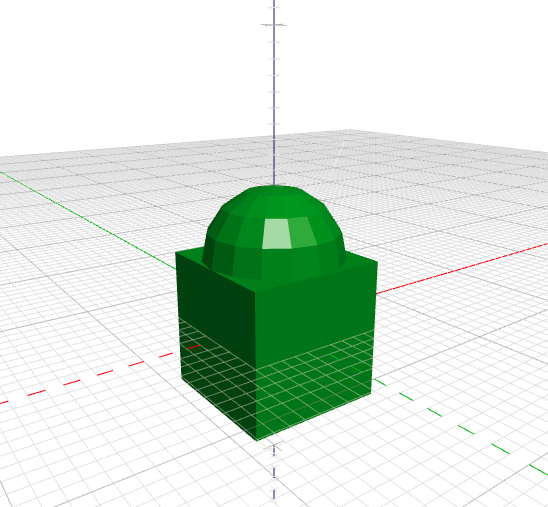 |
| 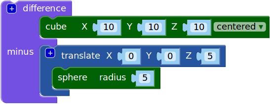 |  |

Si has llegado hasta aquí, enhorabuena. Ya sabes lo básico para defenderte con BlocksCAD

## Actividad propuesta

Entrénate con BlocksCASD intentando modelar la siguiente figura. No tiene que ser exactamente igual pero sí parecida:

|           Vista 1            |           Vista 2            |
| :--------------------------: | :--------------------------: |
| 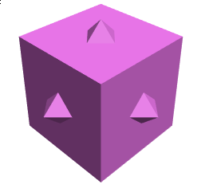 | 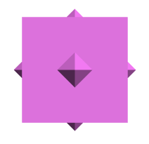 |

Tienes una posible solución en [<https://www.blockscad3d.com/community/projects/82576>](<https://www.blockscad3d.com/community/projects/82576>)

# Estrella Mudéjar

## Justificación

La **estrella mudéjar** es un elemento decorativo ampliamente utilizado desde tiempos remotos por diferentes civilizaciones mediterráneas.  Esta estrella ha tenido diferentes nombres según la civilización, pero para nosotros resulta familiar por aparecer, sobre todo, en el arte árabe del Al-andalus y en el arte mudéjar.

Es una estrella de ocho puntas y aparece al superponer los centros de dos cuadrados idénticos pero uno girado 45º con respecto al otro:

En Aragón resulta un ornamento muy característico del mudéjar, y en concreto del turolense. Tal es su relevancia que para hacer alusión a la Autovía Mudejar el escultor zaragozano Julio Tapia realizó una obra con dicha estrella. Podéis verla cuando vayáis por la Autovía o si no os queréis mover en este [enlace](https://www.esculturaurbanaaragon.com.es/psingra2.htm).

Desde un punto de vista matemático, su modelado en 3d nos va a permitir trabajar conceptos como la diferencia de conjuntos, traslaciones, rotaciones, ángulo central, apotemas, radios y relaciones entre los lados de un triángulo rectángulo (trigonometría).

## Actividad inicial guiada: Estrella mudéjar sencilla

Para empezar, vamos a realizar **una sencilla estrella mudejar** con dos prismas cuadrados de dimensiones 10x10x5 (eje_x, eje_y, eje_z o para entendernos, ancho por largo por alto):

### Unas preguntas de teoría

- ¿Cuánto mide **la apotema de la base cuadrada**?¿Tiene alguna relación con el lado del cuadrado?¿Y si el cuadrado tuviera un lado diferente, la relación se mantendría?
- ¿Crees que para otros polígonos regulares va a seguir existiendo una **relación entre el lado y la apotema**?
- ¿Sabes algo de **trigonometría**? En caso afirmativo, las preguntas anteriores deberían resultarte sencillas. En caso contrario, **no te preocupes** la parte teórica la facilitaremos para que puedas hacer el modelado si te ves desbordado.

### Respuestas a las preguntas

- La **apotema** es la mitad del lado. 
- Sí, siempre va a haber relación. La respuesta  está en la **semejanza de triángulos rectángulos** y **la trigonometría**. Esto nos permitirá calcular bien el radio, la apotema o el lado del polígono regular siempre que nos den uno de ellos. 

  ​    

### Modelado en BlocksCAD

| Paso                                                         | Código                                   | Renderizado                                |
| ------------------------------------------------------------ | ---------------------------------------- | ------------------------------------------ |
| Insertamos un cubo de 10x10x5 centrado en origen             | 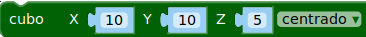   | 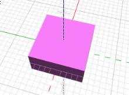   |
| Insertamos otro igual pero girado 45º sobre el plano XY (girar el eje Z) | 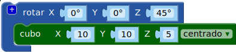 | 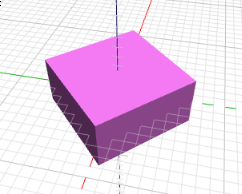 |
| Juntamos los dos objetos para formar un único objeto         | 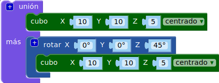   | 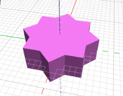   |

## Actividad 2: "Estrella mudéjar" sobre un hexágono regular

Vale, la actividad anterior era muy sencilla y además era guiada. Ahora se propone realizar una especie de estrella mudejar modificada a partir de un hexágono regular de radio y altura que quieras. La figura a modelar debería quedar algo así:

### Cuestiones previas 

- ¿Hacia qué objeto tiende un polígono regular cuando aumentamos el **número de lados** al polígono?
- ¿Cuánto tiene que girar el prisma hexágonal superpuesto para generar las puntas en mitad de las aristas del prisma original?¿Puedes dar una **fórmula general** que vaya en función del número de lados y que por tanto sirva para el cuadrado o el hexaǵono?

### Consideraciones a las cuestiones

- Al aumentar el número de lados, el polígono se va acercando a un **círculo** como se puede ver en la siguiente animación:

  

- BlocksCAD interpreta los **cilindros** de esta manera, **como un prisma de base regular con un número de lados elevado**. 

- Podemos generar un prisma de base regular modificando el número de lados asociado a un cilindro con el bloque :
  

- La **rotación** que hay que hacer es la mitad del ángulo central: $$\frac{180}{nlados}$$

- **Importante:** Al usar el bloque cilindro modificado por el número de aristas, **el parámetro que le damos es el radio del polígono regular** y no la longitud de la arista (o lado del polígono regular)

  ### Modelado en BlocksCAD

  Se propone como ejercicio su modelado. Al final de la documentación tienes un enlace a una posible solución.

## Actividad 3: "Estrella mudéjar" del número de lados que queramos con hueco. Estrella mudéjar paramétrica

Con el esfuerzo que ha costado modelarla estaría bien que en lugar de que se generara a partir de un hexágono lo haga de un **polígono del número de lados cualquiera**  y del tamaño de lado que se quiera. Para ello tendrás que modificar el código para que reciba el número de lados como un parámetro (léase variable).

Si hacemos la **diferencia** con otra estrella igual de lado menor obtendremos el contorno de la estrella. Intenta hacerlo de forma paramétrica. Parámetros o variables a utilizar:

- **Número de lados** del polígono regular que genera la estrella
- **Longitud** del radio del polígono
- Longitud del radio del polígono que genera el **hueco**

**Ejemplo:**  Estrella de David generada  con triángulos de radios 10 y 8, exterior e interior respectivamente.   

- ### Modelado en BlocksCAD

  Se propone como ejercicio su modelado. Al final de la documentación tienes un enlace a una posible solución.

## Actividad 4: "Estrella mudéjar" paramétrica con puntas diferentes. Estrella mudejar paramétrica avanzada 

Vamos a añadir un poco de complejidad al programa. En las estrellas anteriores todas las puntas son iguales. Ahora en lugar de que la mitad de las puntas las genere el prisma poligonal girado se pide que sean **los generados por un prisma cuadrado** con la diagonal superpuesta sobre la arista (el lado del cuadrado se pide que sea **1/3 de la arista**).

Como una imagen vale más que mil palabras:

Además quedará más bonita con un hueco en el interior con el grosor que se le pase por parámetro. 

Se pide por tanto modelar una estrella que tenga como parámetros:

- **Número de lados**
- Longitud del **lado**
- **Grosor** de la estrella: Altura y anchura del contorno. Opcional: Si se quiere se pueden hacer dos parámetros.

El resultado tiene que ser algo así para un polígono generador de 8 lados:

### Cuestiones previas  

- Hemos visto que los prismas de base poligonal distinta del cuadrado se generan a partir del radio del polígono. ¿Existe alguna **fórmula general** que **relacione** la longitud del **lado** con el **radio**?¿Y alguna relación entre la **apotema** y  el **lado**?
- El cuadrado que genera las puntas, **¿Cuánto hay que trasaladarlo?**
- ¿Cuántas **rotaciones** hay que hacer del cuadrado para generar todas las puntas?¿Qué ángulo entre ellos?

### Respuestas a las cuestiones previas

- La respuesta a la primera cuestión la encontramos en la **trigonometría**: Fíjate en la siguiente animación y los ángulos que aparecen:

  

  - El **triángulo** formado por el centro del polígono, el  punto medio de un lado y un vértice adyacente es **siempre rectángulo**. El ángulo correspondiente al centro del polígono es **la mitad del ángulo central**: $$\alpha=\dfrac{\frac{360}{n_{lados}}}{2}$$

  - **Fijado el número de lados** del polígono regular, aunque varíe el tamaño del lado, los triángulos que salgan serán semejantes. **Al ser semejantes los lados son proporcionales**, o dicho de otra forma, **la razón entre lados se mantiene constante y dependen exclusivamente del ángulo** que se apoya en el centro del polígono: Son las **razones trigonométricas**. La principales son:

    | Razón trigonométrica                        | Aplicación en el polígono regular       |
    | ------------------------------------------- | --------------------------------------- |
    | **seno** = lado opuesto / hipotenusa        | $\sin{\alpha}=\frac{semilado}{radio}$   |
    | **coseno** = lado contiguo / hipotenusa     | $\cos{\alpha}=\frac{apotema}{radio}$    |
    | **tangente** = lado opuesto / lado contiguo | $\tan{\alpha}=\frac{semilado}{apotema}$ |

- El cuadrado hay que trasladarlo **la apotema del polígono**

- Habrá que hacer **tantas puntas como lados** y habrá que **rotar la mitad del ángulo central**: $$\alpha=\frac{180}{nlados}$$

**Ejemplo de aplicación:** Determina el radio y la apotema para un **pentágono regular de lado 6**:

- **radio = (6/2)/seno(180/5)**
- **apotema = (6/2)/tan(180/5)**

### Modelado en BlocksCAD

Se propone como ejercicio su modelado. 

Los siguientes pasos te pueden servir de guía:

1. Construye una función que permita **calcular el radio de un polígono** regular a partir del lado
2. Construye una función que permita **calcular la apotema de un polígono** regular a partir del lado
3. Construye el **prisma poligonal paramétrico** (número de lados, lado y grosor)
4. Construye el **cuadrado que generará las puntas diferentes**, rótalo y giralo. **Repite el proceso** las veces que necesites
5. **Unifica en un solo objeto** los construidos en los pasos 3 y 4
6. Construye la **estrella** que servirá de **hueco**
7. **Vacía de la estrella** inicial la estrella que sirve de hueco

**Ayuda:**

1. Para el *paso 1* puedes fijarte en los siguientes bloques:

   

   Mira cómo se hace en la siguiente animación:

   

2. Para el *paso 4*, la repetición de cuadrado, se hace con un bloque de tipo *contar* que aparece en el menú *secuencias* (En *opciones* has tenido que seleccionar *Colección avanzada de bloques*)

   

No obstante, si no lo has conseguido pero quieres ver cómo se puede hacer, al final de la documentación tienes un enlace a una posible solución.

## Enlaces

Aquí tienes unas posibles soluciones, pero **no las mires** hasta que lo hayas hecho tú. ¡Si no, no tiene gracia! :

- [Estrella mudéjar sencilla](https://www.blockscad3d.com/community/projects/266387)
- [Estrella "mudejar" hexagonal](https://www.blockscad3d.com/community/projects/272240)
- [Estrella "mudéjar" paramétrica sencilla](https://www.blockscad3d.com/community/projects/278006)
- [Estrella "mudéjar" paramétrica](https://www.blockscad3d.com/community/projects/267149)

 

##
